## 1.硬件设备

### 1.1正点原子ATK-DLRV1126 Linux开发板

#### 1.1.1SoC：瑞芯微RV1126

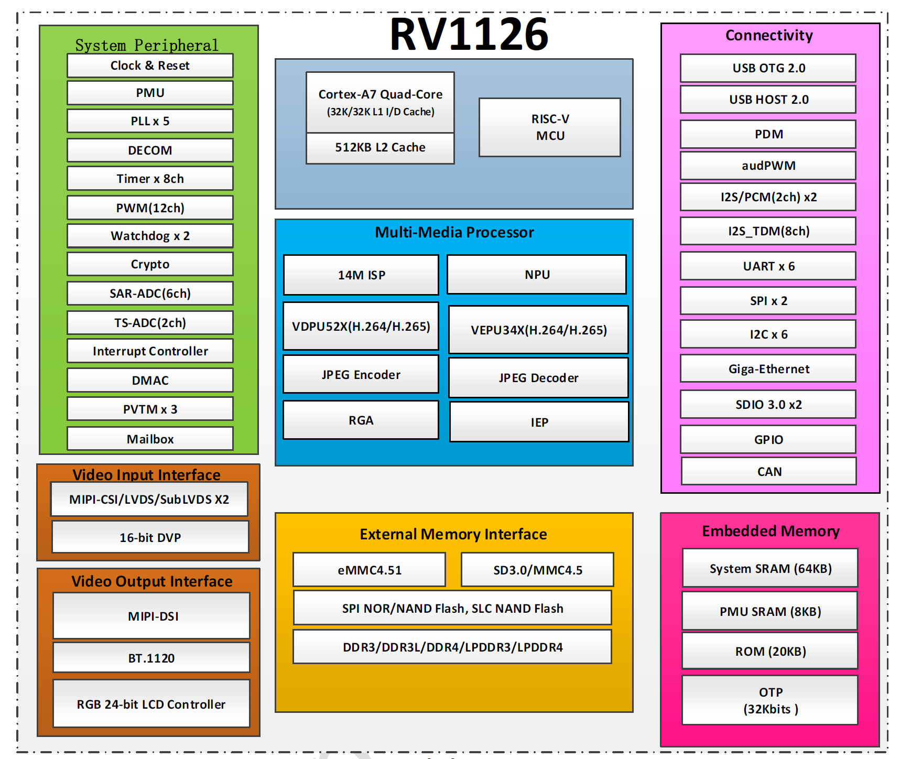

**CPU**：四核ARM Cortex-A7 1.5GHZ and RISC-V MCU 200MHZ

**14M ISP with 3帧HDR**：完成从RAW数据到可观看图像（YUV/RGB）的全套流水线处理。最大支持1400W像素分辨率的图像输入。

**NPU**：2.0Tops NPU，support INT8/INT16

> Tops表示NPU在INT8精度下理论计算峰值是每秒2万亿次操作（乘加运算MAC，一次MAC算2次操作），如果是INT16则算力约为1Tops
>

**VDPU52X(H.264/H.265)**：视频解码硬件单元，用于将压缩视频码流解码为YUV帧，支持H.264/H.265

**VEPU34X(H.264/H.265)**：视频编码硬件单元，用于将原始图像（YUV）压缩为视频码流

**JEPG Encoder/JEPG Decoder**：JPEG硬件编解码单元，用于抓拍照片，YUV/RGB<->JPEG

**RGA2 e plus**：2D图像图形处理单元，支持图像缩放、颜色空间转换（YUV<->RGB）、裁剪、旋转等

**IEP**：图像增强处理单元，用于图像增强和降噪

#### 1.1.2正点原子PCB板（包括核心板与底板）

SoC 配合 PCB 板构成了开发板。如果 PCB 也是由 SoC 厂商（原厂）设计的，通常被称为原厂参考板（EVB）；如果 PCB 是由第三方公司自主设计的，则被称为方案板或三方板，而这些公司通常被称为方案商

ROM：8GB EMMC

RAM：x2，2GB DDR4

5.5寸MIPI触摸屏模块，720*1280@60fps

MIPI CSI接口 x2

### 1.2摄像头：MIPI ATK-MCIMX415 

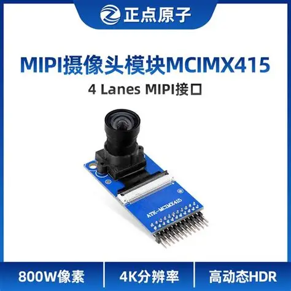


在嵌入式领域，摄像头模组分为两类（1）UV Sensor（自带ISP），即摄像头模组里集成了一个小芯片ISP。优点：MCU接上就能用，省事。缺点：画质差，功能弱。这种摄像头不需要RV1126的ISP（2）AW Sensor（不带ISP），即摄像头模组里只有传感器。如IMX415，它只管吐出RAW数据，必须依赖RV1126内部强大的14M ISP来处理这些数据。优点：画质好

## 2.模型

### 2.1RKNN_OP_Support_And_Limit

**RKNN_OP_Support**：convolution  2D、batchnorm2d、silu(swish)、slice、cat、max_pool2d、upsample_nearest2d、add、sigmoid、reshape、matmul

### 2.2YoLv5s三分类目标检测（人脸、手机、吸烟）

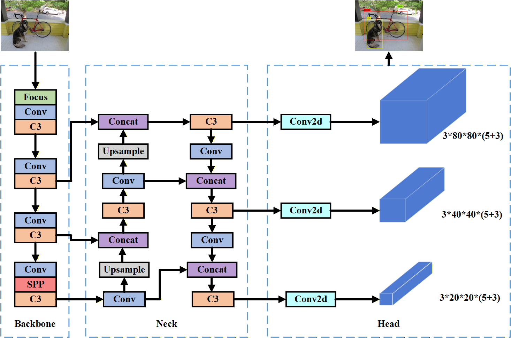

- **Focus**：Slice + Concat + Conv
- **Conv**：Conv2D + BatchNorm + SiLU
- **C3**：Conv + Concat + ADD+Concat
- **SPP**：MaxPool + Concat
- **Upsample**
- **Concat**
- **Detect**：Conv + Sigmoid + Reshape + MatMul

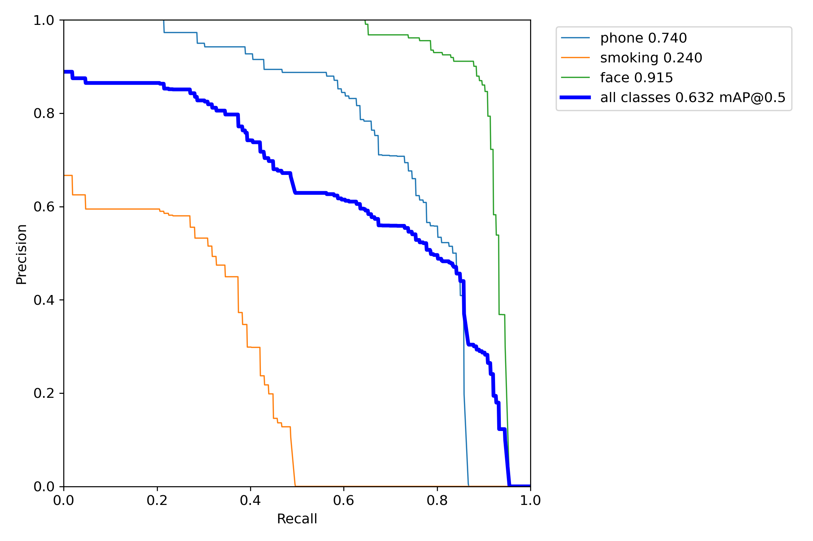

人脸98关键点检测与人脸识别都是CNN，backbone都类似，只是检测头和损失函数的设计有区别，回归任务还是分类任务罢了

## 3.模型剪枝、格式转换、量化与预编译

### 3.1环境

RKNN-Toolkit 版本不能高于开发板上的 NPU 驱动（librknn_runtime）版本

> RKNN-Toolkit 1.7.3与librknn_runtime version 1.7.5

### 3.2剪枝

[模型剪枝的概念分类方法流程与核心算法解析-开发者社区-阿里云](https://developer.aliyun.com/article/1644450)


### 3.3模型转换与量化

在特定的条件下，可以把输入数据拷贝次数减少到零，即零拷贝。比如，当RKNN 模型是非对称量化，量化数据类型是uint8，3 通道的均值是相同的整数同时缩放因子相同的情况下，归一化和量化可以省略。

#### 3.3.1模型转化

RV1126芯片搭载的是瑞芯微自研的NPU，算力约为2.0 TOPS，其核心优势在于高能效比。它并不直接运行PyTorch或TensorFlow模型，而是运行专有的.rknn格式模型。这个转换过程（Model Conversion）是一个复杂的编译优化过程，而非简单的格式转存。

首先是**图优化（Graph Optimization）与算子融合（Operator Fusion）**。在深度学习框架中，一个卷积层（Conv2d）后面往往紧跟一个批归一化层（BatchNorm）和一个激活函数层（如SiLU或ReLU）。在推理阶段，这三个操作的数学公式可以被合并为一个单独的线性变换公式。rknn-toolkit在解析ONNX模型时，会自动识别这种模式并进行融合。


#### 3.3.2量化

[神经网络量化入门--基本原理 - 大白话AI - 博客园](https://www.cnblogs.com/jermmyhsu/p/13169254.html)

量化模型使用较低的精度(int8/uint8/int16)保存模型权重信息。在部署时可以使用更少的存储空间，获得更快的推理速度。各深度学习框架训练、保存模型时，通常使用浮点数据，所以模型量化是模型转换中非常重要的一环.

RKNN-Toolkit目前支持两种量化模型（1）RKNN Toolkit根据用户提供的量化数据集，对加载的浮点模型进行量化，生成量化的RKNN模型。支持的量化精度类型uint8、int8、int16，量化方式为训练后静态量化，量化粒度per-layer，不支持per-channel（2）由深度学习框架导出量化模型，RKNN Toolkit根据量化信息生成量化RKNN模型。支持的深度学习框架，pytorchv1.9.0、onnx（onnxruntimev1.5.1），支持的量化精度类类型，uint8、int8，量化方式，训练后静态量化、QAT

训练后静态量化支持三种方式，默认第一种，也是谷歌提出的方法

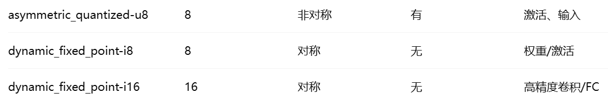 

PTQ 是“死量化”，模型量化参数固定，推理引擎只要支持 INT8 就行；
 QAT 是“活量化”，训练时模拟量化误差依赖具体量化算法，部署引擎必须一致，否则精度可能大幅下降。

**为什么要校准数据集**

在深度学习中，数据流过每一层时，产生的中间结果图（特征图/Activation）的数值范围是动态变化的。Layer1的输出可能在0\~1之间，Layer100的输出可能在-100\~200之间。当把float32（范围极大）转化为INT8（-128\~127，只有这256个格子）时，必须决定这256个格子代表多大的范围。

如果没有校准数据集，工具不知道每一层的数据有多大，只能盲目的设置为-1000\~1000，而实际范围是0\~1，那么所有的数据就会被挤到一个格子中，精度彻底丢失。而有了校准数据集，预先跑一遍，统计每一层的最大值、最小值和分布直方图，这样量化系数就会很精准，精度损失最小

校准数据集作用（1）计范围，确定每一层激活值的动态范围。比如记录某一层大部分参数都落在0\~1之间（2）算参数，根据统计结果，计算每一层的量化银子和0点。这些参数会写入.rknn文件，NPU运行时靠这些参数把整数还原为浮点数

**如何注意校准数据集**

1.图片数量不用多，训练集中有代表性的100\~500张图片就足够。

2.预处理必须一致，RKNN在读取校准数据集时会进行归一化，这里的设置必须与训练时完全一样。如果训练时是`input = (pixel - 127.5) / 128.0`，转换时

```
mean_values=[127.5, 127.5, 127.5]
std_values=[128.0, 128.0, 128.0]
```

如果校准时的预处理搞错了，量化出来的参数就是错误的，模型精度会直接崩盘

yolov5s 4.0在训练时没有减均值和除方差操作，只有这一行。

```python
imgs = imgs.to(device, non_blocking=True).float() / 255.0  # uint8 to float32, 0-255 to 0.0-1.0
```

因此，在将其转化为.rknn模型时，

```python
mean_values=[0, 0, 0]
std_values=[255, 255, 255]
```

### 3.4预编译


## 4.模型部署

### 4.1PipeLine

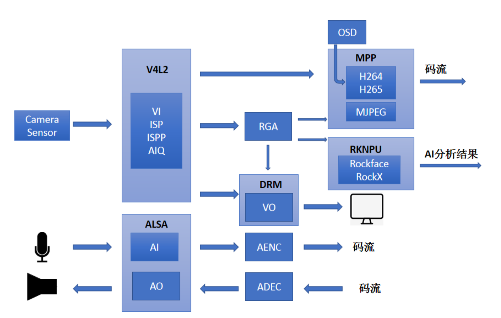

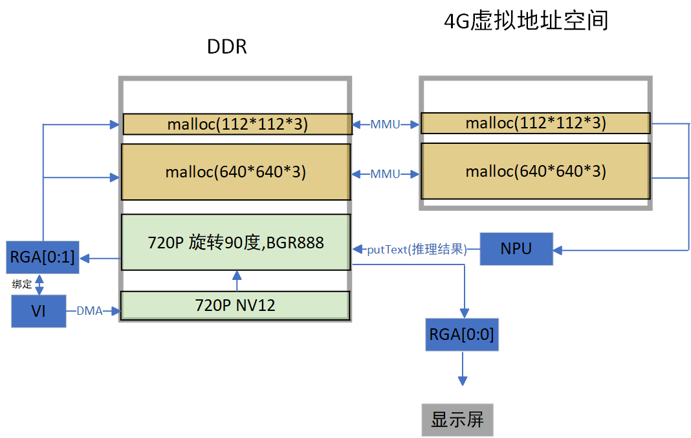

### 4.2RGA

#### 4.2.1格式转换与旋转

```c++
RGA_ATTR_S stRgaAttr1;
memset(&stRgaAttr1, 0, sizeof(stRgaAttr1));
stRgaAttr1.bEnBufPool = RK_TRUE;
stRgaAttr1.u16BufPoolCnt = 3;
stRgaAttr1.u16Rotaion = 270;
stRgaAttr1.stImgIn.u32X = 0;
stRgaAttr1.stImgIn.u32Y = 0;
stRgaAttr1.stImgIn.imgType = IMAGE_TYPE_NV12;
stRgaAttr1.stImgIn.u32Width = video_width;
stRgaAttr1.stImgIn.u32Height = video_height;
stRgaAttr1.stImgIn.u32HorStride = video_width;
stRgaAttr1.stImgIn.u32VirStride = video_height;
stRgaAttr1.stImgOut.u32X = 0;
stRgaAttr1.stImgOut.u32Y = 0;
stRgaAttr1.stImgOut.imgType = IMAGE_TYPE_BGR888;
stRgaAttr1.stImgOut.u32Width = disp_width;
stRgaAttr1.stImgOut.u32Height = disp_height;
stRgaAttr1.stImgOut.u32HorStride = disp_width;
stRgaAttr1.stImgOut.u32VirStride = disp_height;
ret = RK_MPI_RGA_CreateChn(1, &stRgaAttr1);
if (ret) {
    printf("ERROR: create RGA[0:1] falied! ret=%d\n", ret);
    return -1;
}
```

**1.新建RGA[0:1]通道将图像格式从NV12转为BGR888并旋转270度**

为了方便RKNPU处理图像以及使用OpenBCI添加AI分析结果

屏幕使用的是正点原子的5.5寸MIPI接口电容触摸屏`ATK-MD0550-7201280`，该模块分辨率为720*1280竖屏(60帧)。由于是竖屏，因此图像矩阵需要旋转270度，如下图所示。

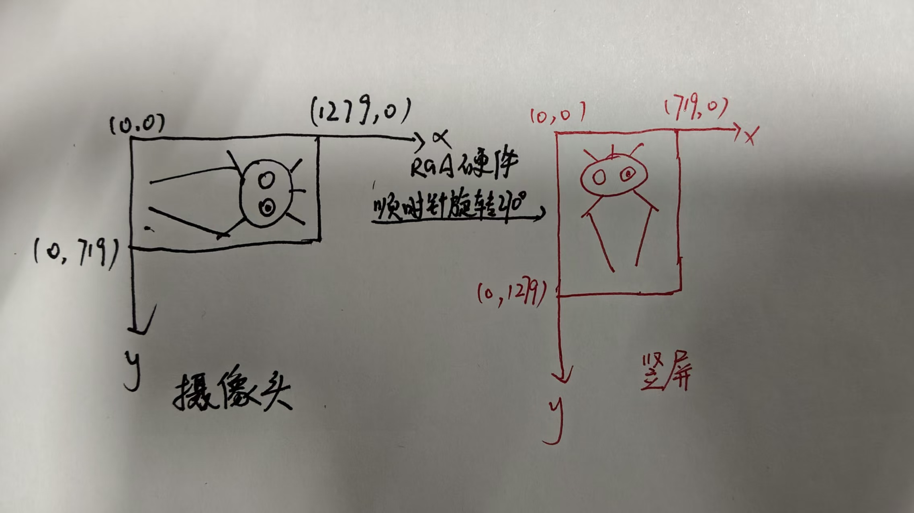

```c
typedef struct {
    void* vir_addr; /* CPU使用的虚拟地址。典型来源：malloc()、drm_buf_alloc()、mmap()、RK_MPI_MB_GetPtr(src_mb)。特点：最慢。RGA用它的时候需要做虚实转换，效率低 */
    void* phy_addr; /* 硬件看到的真实的物理地址。特点：最快但最危险。现代linux为了安全和隔离，用户态程序通常拿不到物理地址，一般在裸机或内核态驱动中使用 */
    int fd; /* 共享文件描述符。作用：跨模块共享buffer，如ISP->RGA，RGA->NPU。特点：现代标准，零拷贝，可以跨进程 */
    rga_buffer_handle_t handle; /* buffer句柄。特点：常见于图形子系统，是 */
     /* 逻辑（屏幕）分辨率 */
    int width; /* width */
    int height; /* height */
    /* 内存里真正分配的步长。为什么会有stride？硬件对齐，大多数GPU/ISP/RGA不会严格按照1280、720这样的任意数分配内存，而是会向上对齐。比如1280可能对齐到1344，720可能对齐到736
    有效区域(1280)   | padding
	[████████████] [    ]
	[████████████] [    ]
	... 720行
	[████████████] [    ]
	剩下16行是对齐填充（736-720）
	这样做的原因是更利于DMA传输。此处width=wstride、height=hstride */
    int wstride; /* wstride */
    int hstride; /* hstride */
    int format; /* RK_FORMAT_RGB_888、RK_FORMAT_BGR_888、RK_FORMAT_NV12等 */
    
    int color_space_mode; /* color_space_mode */
    int global_alpha; /* 全局透明度。0：完全透明，255：不透明。用于叠加 */
    int rd_mode;
} rga_buffer_t;
```

**使用实例**

```c
drm_buf = drm_buf_alloc(&drm_ctx, drm_fd, video_width, video_height, channel * 8, &buf_fd, &handle, &actual_size);
```

`&buf_fd`：共享给别的进程/模块的通行证（DMA_BUF fd）

`handle`：仅供DRM/RGA内部识别这块buffer的ID

将一块内存空间类比为房子，那么fd类似于房产证编号，外人（其他进程）只认房产证编号（FD）。物业（DRM/RGA驱动）内部管理用的房号（handle）

**文件描述符与rga_buffer_t中的int fd;是一种东西吗**

本质上是一类东西，都是Linux中的文件描述符。但rga_buffer_t.fd特指一个DMA-BUF文件描述符，用来共享图像缓冲区。

```c
int fd = open("test.txt", O_RDONLY);
```

这个fd指向磁盘上的一个普通文件，或socket、设备文件等

而`drm_buf_alloc`中的buf_fd指向的是一块显存，可以被ISP（摄像头）、RGA（图像处理）、NPU（RKNN）、DRM（显示）共同访问的一块物理内存。

```c
src.fd=buf_fd
```

当这样写时，是在告诉RGA这块图像buffer不要自己malloc()，直接用这个DMA-BUF fd指向的共享显存。这也是零拷贝实现的基础

### 4.3Yolov5s后处理

```c++
//三个容器分别存放检测框坐标、置信度、类别
std::vector<float> filterBoxes;
std::vector<float> boxesScore;
std::vector<int> classId;
//存放最终结果，最多检测64个物体
#define OBJ_NUMB_MAX_SIZE 64
typedef struct _detect_result_group_t
{
    int id;
    int count;
    detect_result_t results[OBJ_NUMB_MAX_SIZE];
} detect_result_group_t;
```

**置信度过滤**：NPU 输出的每个预测框都会带有一个置信度，表示该框包含目标的概率。先根据设定的阈值（0.4）过滤掉置信度较低的框，减少后续处理的计算量。

**置信度快速排序**：使用快排对置信度从高到低排列，方便nms。

**非极大值抑制** ：对于同一个物体（比如一张脸），NPU 可能会预测出 5 个重叠的框。需要计算这些框之间的 **IoU（Intersection over Union）**，把重叠度高的框删除，只保留置信度最高的框，从而避免重复检测。人脸只保留置信度最高的一个

**坐标还原**：NPU 的输出坐标通常是在网络输入尺寸（如 `640x640`）下的，需要映射回原图尺寸（如 `1920x1080`）才能在原图上准确定位目标。这一步通常涉及缩放和偏移的计算，保证检测框与原图对齐。

**类别映射**：如果模型检测多类目标，需要把每个预测框对应的类别 ID 转换为实际的类别名称（如 `0 → person, 1 → car`）。

**结论**：这一步是纯 CPU 计算。如果C++ 后处理写得烂，经常会出现 **“NPU 算得飞快（10ms），但 CPU 后处理卡半天（30ms）”** 的情况。


### 4.4如何画框写字

#### 4.4.1OpenCV

直接操作`RK_MPI_MB_GetPtr`获取的内存指针，利用CPU进行像素修改

优点（1）发快，API简单直观，一行代码就能完成画框写字（2）能丰富，支持各种字体、字号

缺点（1）PU负载高，在720P（1280*720）图像上遍历像素并修改颜色，会导致CPU占用率飙升，抢占NPU和业务逻辑CPU的时间（2）格式兼容性差，RV1126的硬件（ISP、NPU）通常喜欢NV12格式，opencv的puttext只能处理BGR/RGB格式（但是RGA进行了格式转换，所以这个应该不是问题）（3）存一致性问题，CPU修改了内存，但硬件可能还在读取Cache中的旧数据，导致画上去的框闪烁或不显式，需要手动做Cache Flush


## 5.性能优化

### 5.1看指标

#### 5.1.1系统中断

```
cat /proc/interrupts
```

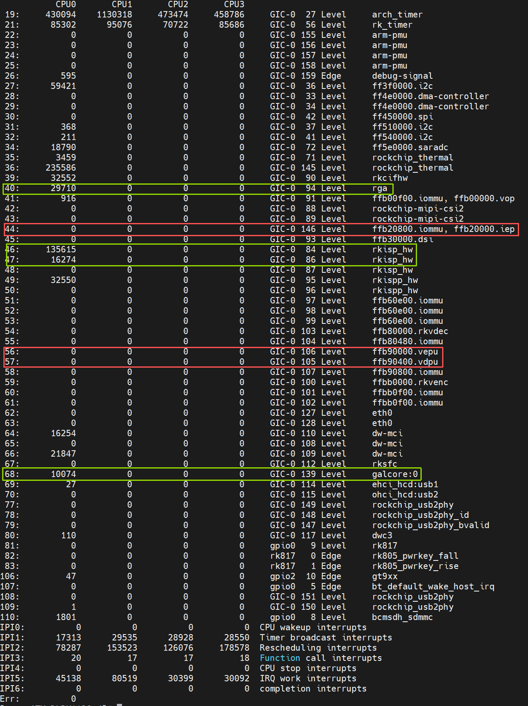

可以看到rga、isp、npu（galcore）都产生了中断，并通过中断控制器GIC-0交由CPU0处理

如果想实时查看某一中断触发次数，使用下面这个命令查看。如果数字在增加，说明程序正在使用NPU加速

```
watch -n 1 "cat /proc/interrupts | grep galcore"
```

#### 5.1.2NPU配置

```
cat /sys/class/devfreq/ffbc0000.npu/load
//100@934000000Hz
cat /sys/class/devfreq/ffbc0000.npu/governor
//userspace
cat /sys/class/devfreq/ffbc0000.npu/max_freq
//934000000
cat /sys/class/devfreq/ffbc0000.npu/min_freq
//200000000
```

NPU 被“人为强制”锁定在了最高性能模式，当前的“100%”只是代表它“满油门空转”，并不代表它正在计算

RV1126的NPU并非 Rockchip 完全自研的，而是购买了芯原微电子旗下Vivante公司的IP核。`galcore`是Vivante公司为其硬件核心提供的标准底层驱动名称

### 5.2模型

yolov5s模型量化前28MB，量化为uint8后7.2MB，预编译后5.9MB。

人脸识别模型量化前4.8MB，量化为int16后2.5MB，预编译后2.8MB。

人脸98关键点检测模型预编译后0.7MB。

#### 5.2.1准确性评估

**yolov5s.pre.rknn**

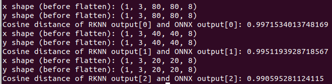

**mobilefacenet.rknn**

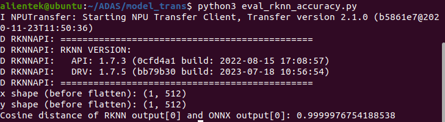

#### 5.2.2性能评估

**yolov5s.pre.rknn**

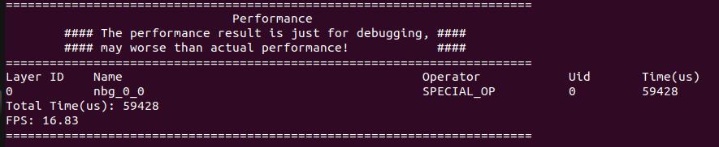

**yolov5s.rknn**

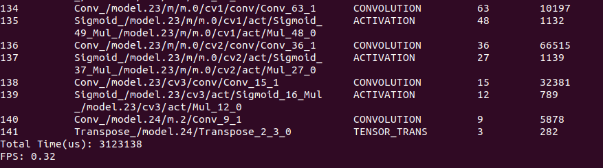

**mobilefacenet.pre.rknn**

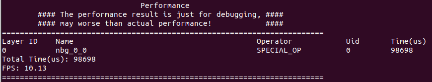

**mobilefacenet.rknn**

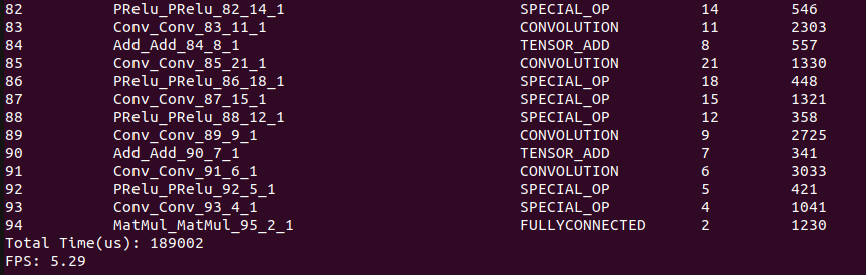

**pfpld.pre.rknn**

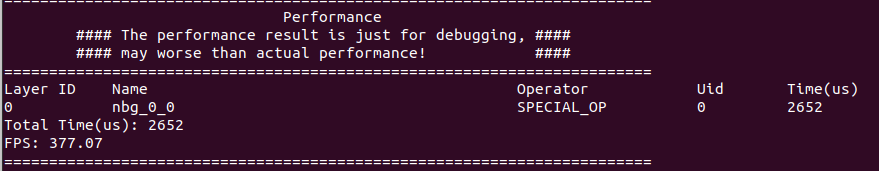

**pfpld.rknn**

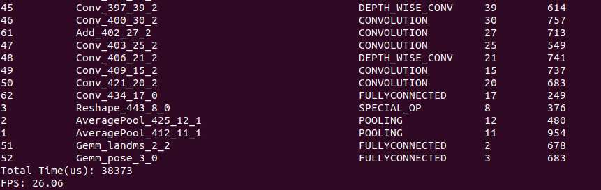

#### 5.2.3内存评估

**yolov5s.pre.rknn**

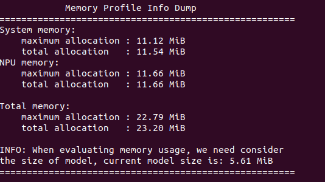

**mobilefacenet.rknn**

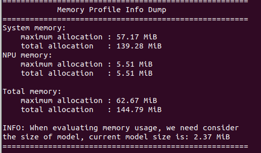

**pfpld.pre.rknn**


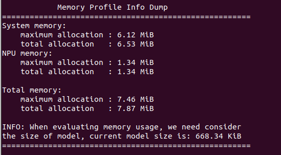

## 6.嵌入式GUI


​        
